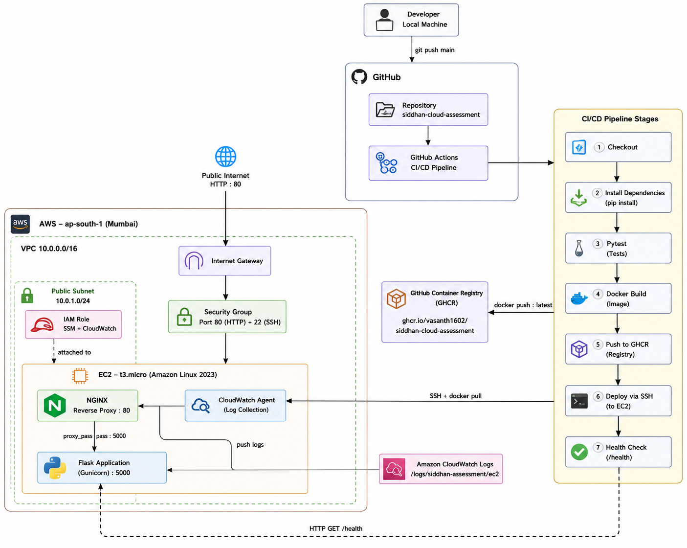

# Siddhan Cloud Assessment

A production-ready Flask API deployed on AWS using Terraform, Docker, NGINX, and GitHub Actions CI/CD. Built as part of the Siddhan Intelligence Cloud Engineer technical assessment.

**Live Application:** `http://3.109.47.241`

---

## Table of Contents

- [Overview](#overview)
- [Architecture](#architecture)
- [Repository Structure](#repository-structure)
- [Prerequisites](#prerequisites)
- [Infrastructure](#infrastructure)
- [CI/CD Workflow](#cicd-workflow)
- [Setup Guide](#setup-guide)
- [API Endpoints](#api-endpoints)
- [Design Decisions](#design-decisions)
- [Security Considerations](#security-considerations)
- [Trade-offs](#trade-offs)
- [Cost Awareness](#cost-awareness)
- [Future Improvements](#future-improvements)

---

## Overview

This project demonstrates end-to-end cloud engineering by deploying a Python Flask API on AWS infrastructure provisioned entirely with Terraform. Every push to `main` automatically triggers a 7-stage CI/CD pipeline that tests, builds, containerizes, and deploys the application — with zero manual steps required after the initial infrastructure setup.

**Stack at a glance:**

| Layer | Technology |
|---|---|
| Cloud Provider | AWS (ap-south-1 — Mumbai) |
| Infrastructure as Code | Terraform >= 1.5.0 |
| Application | Python 3.9 + Flask + Gunicorn |
| Containerization | Docker (multi-stage build) |
| Container Registry | GitHub Container Registry (GHCR) |
| Reverse Proxy | NGINX |
| CI/CD | GitHub Actions |
| Monitoring | AWS CloudWatch Agent |
| IAM | Least-privilege EC2 role (SSM + CloudWatch) |

---

## Architecture



### Request Flow

```
Developer (git push main)
    │
    ▼
GitHub Actions (7-stage pipeline)
    │
    ├── Build & push Docker image → GHCR
    │
    └── SSH deploy to EC2
              │
              ▼
         AWS VPC (10.0.0.0/16)
              │
         Internet Gateway
              │
         Security Group (Port 80 + 22)
              │
         EC2 t3.micro (Amazon Linux 2023)
              │
         NGINX :80 (reverse proxy)
              │
         Flask Container :5000 (Gunicorn)
```

---

## Repository Structure

```
siddhan-cloud-assessment/
│
├── app/
│   ├── app.py                  # Flask API — /, /health, /info endpoints
│   ├── requirements.txt        # flask, gunicorn, pytest
│   ├── Dockerfile              # Multi-stage build, non-root user, Gunicorn
│   └── tests/
│       ├── __init__.py
│       └── test_app.py         # 3 pytest tests covering all endpoints
│
├── terraform/
│   ├── provider.tf             # AWS provider, version constraints
│   ├── main.tf                 # VPC, Subnet, IGW, RT, SG, IAM, EC2
│   ├── variables.tf            # Input variables with sensible defaults
│   ├── outputs.tf              # public_ip, app_url, health_url, ssh_command
│   ├── user_data.sh            # EC2 bootstrap: Docker + NGINX + CloudWatch
│   └── terraform.tfvars.example
│
├── .github/
│   └── workflows/
│       └── deploy.yml          # 7-stage CI/CD pipeline
│
├── docs/
│   └── architecture.png        # Architecture diagram
│
├── .gitignore
└── README.md
```

---

## Prerequisites

### Required Tools

| Tool | Version | Purpose |
|---|---|---|
| [Terraform](https://developer.hashicorp.com/terraform/install) | >= 1.5.0 | Infrastructure provisioning |
| [AWS CLI](https://aws.amazon.com/cli/) | v2 | AWS authentication |
| [Git](https://git-scm.com/) | Any | Version control |
| [Docker](https://www.docker.com/) | Any | Local image testing only |
| [Python 3.9](https://www.python.org/) | 3.9 | Local app testing only |

### AWS Account Setup

1. Create an AWS account (free tier eligible)
2. Create an IAM user with programmatic access
3. Configure AWS CLI — **this must be done before running Terraform**:

```bash
aws configure
```

Enter when prompted:
```
AWS Access Key ID:     <your-access-key-id>
AWS Secret Access Key: <your-secret-access-key>
Default region:        ap-south-1
Default output format: json
```

4. Verify authentication:

```bash
aws sts get-caller-identity
```

Expected output:
```json
{
    "UserId": "AIDA...",
    "Account": "123456789012",
    "Arn": "arn:aws:iam::123456789012:user/your-username"
}
```

### EC2 Key Pair (Manual Step)

The EC2 SSH key pair must be created manually in the AWS Console — Terraform references it by name but does not create it.

1. Go to **AWS Console → EC2 → Network & Security → Key Pairs**
2. Click **Create key pair**
3. Configure:
   - **Name:** `siddhan-assessment-key`
   - **Type:** RSA
   - **Format:** `.pem`
4. Click **Create key pair** — the `.pem` file downloads automatically
5. Store it **outside the repository** (e.g., `~/siddhan-assessment-key.pem`)

> ⚠️ **Important:** The `.pem` file cannot be downloaded again. If lost, a new key pair must be created. Never commit it to Git — it is already covered by `.gitignore`.

---

## Infrastructure

All infrastructure is provisioned by Terraform in `terraform/main.tf`. No manual console clicks are required after the key pair setup.

### Networking

| Resource | Value | Purpose |
|---|---|---|
| VPC | `10.0.0.0/16` | Isolated network |
| Public Subnet | `10.0.1.0/24` | Hosts EC2 in ap-south-1a |
| Internet Gateway | — | Routes traffic from internet to VPC |
| Route Table | `0.0.0.0/0 → IGW` | Public routing |

DNS support and DNS hostnames are enabled on the VPC, which is required for SSM Session Manager to function.

### Security Group

| Direction | Port | Source | Purpose |
|---|---|---|---|
| Inbound | 80 (TCP) | `0.0.0.0/0` | HTTP application access |
| Inbound | 22 (TCP) | `0.0.0.0/0` | SSH (assessment trade-off — see Trade-offs) |
| Outbound | All | `0.0.0.0/0` | Package installs, Docker pulls |

### IAM Role

An EC2 IAM role is created with only the permissions required:

| Policy | Purpose |
|---|---|
| `AmazonSSMManagedInstanceCore` | Enables SSH-less management via SSM (future use) |
| `CloudWatchAgentServerPolicy` | Allows CloudWatch Agent to push logs |

No `AdministratorAccess` or broad policies are attached. Least-privilege design.

### EC2 Instance

| Setting | Value |
|---|---|
| AMI | Amazon Linux 2023 (dynamically resolved — never hardcoded) |
| Instance Type | t3.micro |
| Storage | 8 GB gp3 (delete on termination) |
| IAM Role | `siddhan-assessment-ec2-role` |
| Bootstrap | `user_data.sh` runs on first boot |

### EC2 Bootstrap (`user_data.sh`)

Runs automatically on first boot. All output is logged to `/var/log/user_data.log` for debugging.

Installs and configures:
- **Docker** — container runtime, `ec2-user` added to docker group
- **NGINX** — reverse proxy configured via heredoc to forward `:80 → :5000`
- **CloudWatch Agent** — configured to push 3 log streams to `/siddhan-assessment/ec2`:
  - `user-data` — bootstrap logs
  - `nginx-access` — NGINX access logs
  - `nginx-error` — NGINX error logs

### Terraform Outputs

After `terraform apply`, the following are printed:

```
application_url = "http://<public-ip>"
health_url      = "http://<public-ip>/health"
instance_id     = "i-0xxxxxxxxxxxxxxxxx"
public_ip       = "<public-ip>"
ssh_command     = "ssh -i siddhan-assessment-key.pem ec2-user@<public-ip>"
```

> **Note on `ssh_command`:** The `.pem` path is relative. Run the command from the directory where your `.pem` file is stored, or replace with the full absolute path:
> ```bash
> ssh -i /full/path/to/siddhan-assessment-key.pem ec2-user@<public-ip>
> ```

---

## CI/CD Workflow

Defined in `.github/workflows/deploy.yml`. Triggered automatically on every push to `main`.

### Pipeline Stages

```
Push to main
    │
    ├── Stage 1: Checkout Code
    ├── Stage 2: Install Dependencies (Python 3.9 + pip)
    ├── Stage 3: Run Tests (pytest — 3 tests, must all pass)
    ├── Stage 4: Build Docker Image (tagged with commit SHA + latest)
    ├── Stage 5: Push to GHCR (ghcr.io/vasanth1602/siddhan-cloud-assessment)
    ├── Stage 6: Deploy to EC2 (SSH → docker pull → docker stop → docker run)
    └── Stage 7: Health Check (retry loop — up to 12 attempts × 5s = 60s)
                  └── Calls /health → must return HTTP 200
                  └── Pipeline FAILS if health check does not pass
```

### GitHub Secrets Required

| Secret | Value |
|---|---|
| `EC2_HOST` | EC2 public IP from `terraform output public_ip` |
| `EC2_USER` | `ec2-user` |
| `EC2_SSH_KEY` | Full contents of the `.pem` file (including `-----BEGIN` and `-----END` lines) |

Configure at: **GitHub Repository → Settings → Secrets and variables → Actions**

### GHCR Package Visibility

After the first pipeline run pushes the image, make the package public:

**GitHub → Profile → Packages → `siddhan-cloud-assessment` → Package settings → Change visibility → Public**

This allows the EC2 instance to pull the image without authentication.

---

## Setup Guide

Follow this exact order:

```bash
# 1. Clone the repository
git clone https://github.com/Vasanth1602/siddhan-cloud-assessment.git
cd siddhan-cloud-assessment

# 2. Configure AWS CLI (if not already done)
aws configure

# 3. Create EC2 key pair in AWS Console (see Prerequisites section)

# 4. Set up Terraform variables
cd terraform
cp terraform.tfvars.example terraform.tfvars
# Edit terraform.tfvars — set key_name = "siddhan-assessment-key"

# 5. Initialize and deploy infrastructure
terraform init
terraform plan
terraform apply

# Note the public IP from outputs

# 6. Add GitHub Secrets (EC2_HOST, EC2_USER, EC2_SSH_KEY)

# 7. Push code to trigger deployment
git push origin main

# 8. After first push — make GHCR package public (see CI/CD section)

# 9. Verify deployment
curl http://<public-ip>/health
```

---

## API Endpoints

| Method | Endpoint | Description | Response |
|---|---|---|---|
| GET | `/` | Root — confirms app is running | `{"app": "siddhan-cloud-assessment", "status": "running", "message": "Welcome to Siddhan Cloud Assessment"}` |
| GET | `/health` | Health check — used by CI/CD pipeline | `{"status": "healthy", "timestamp": "2026-..."}` |
| GET | `/info` | App metadata — version, host, environment | `{"version": "1.0.0", "python_version": "3.9.25", "environment": "production", ...}` |

---

## Design Decisions

### Why AWS?
AWS is the industry standard for cloud infrastructure. It offers the broadest ecosystem, the most mature tooling, and aligns directly with the role requirements. The Mumbai region (`ap-south-1`) was chosen for low latency.

### Why Terraform?
Terraform ensures infrastructure is reproducible, version-controlled, and auditable. Every resource — VPC, subnet, security group, IAM role, EC2 — is created from code. No manual console clicks means no configuration drift.

### Why Flask?
Flask is lightweight, production-proven, and sufficient for demonstrating cloud deployment patterns. It pairs cleanly with Gunicorn as a WSGI server, which is used instead of Flask's built-in development server.

### Why Multi-Stage Docker Build?
The Dockerfile uses a two-stage build: a `builder` stage installs dependencies, and the production stage copies only the installed packages. This keeps the final image minimal and eliminates build tools from production. The container also runs as a non-root user (`appuser`) for security.

### Why NGINX as Reverse Proxy?
Exposing a WSGI server (Gunicorn) directly to the internet is not a best practice. NGINX handles connection management, request buffering, and header forwarding — and positions the stack for future HTTPS/SSL termination without changing the application layer.

### Why GHCR over ECR?
GitHub Container Registry integrates natively with GitHub Actions using `GITHUB_TOKEN` — no additional AWS IAM permissions or secret configuration required. For this assessment scope, GHCR reduces complexity without sacrificing functionality.

### Why Manual `terraform apply` (Not in CI/CD)?
Infrastructure lifecycle and application lifecycle are fundamentally different. Infrastructure changes (adding/removing resources) require deliberate human review. Application deployments can and should be automated. Combining both in CI/CD can lead to unintended infrastructure mutations on every code push.

---

## Security Considerations

- **Least-privilege IAM:** EC2 role has only `AmazonSSMManagedInstanceCore` and `CloudWatchAgentServerPolicy` — no broad access
- **No hardcoded credentials:** AWS authentication uses IAM roles, not access keys embedded in code
- **Non-root container:** Flask container runs as `appuser`, not root
- **IAM role over credentials:** EC2 uses an instance profile — no AWS credentials stored on disk
- **SSM-ready:** `AmazonSSMManagedInstanceCore` policy enables future SSH-less management via AWS Systems Manager
- **CloudWatch monitoring:** Bootstrap, NGINX access, and NGINX error logs are collected and sent to CloudWatch Logs

---

## Trade-offs

### Single EC2 vs. Load Balancer + Auto Scaling
A single EC2 instance was chosen over an Application Load Balancer (ALB) with Auto Scaling Group. Single EC2 is sufficient for assessment scope and eliminates cost. Production would require ALB + ASG for high availability and zero-downtime deployments.

### HTTP vs. HTTPS
The application runs on HTTP only. HTTPS would require a registered domain name and ACM certificate. Without a domain, HTTPS cannot be properly configured. NGINX is already in place to terminate SSL when a domain is available.

### Port 22 Open to `0.0.0.0/0`
SSH access is unrestricted by IP. This is a deliberate assessment trade-off — GitHub Actions runners use dynamic IPs that cannot be whitelisted statically. Production would use AWS Systems Manager Session Manager (already IAM-enabled) to eliminate SSH entirely, or restrict port 22 to a bastion host.

### GHCR (Public Package) vs. ECR (Private)
GHCR with a public package removes the need for EC2 authentication to the registry. Production would use Amazon ECR with an IAM role-based pull policy.

### Dynamic IP vs. Elastic IP
The EC2 instance does not have an Elastic IP attached. If the instance is stopped and restarted, a new public IP is assigned and the `EC2_HOST` GitHub Secret must be updated manually. An Elastic IP was not attached for the following reason: EIP is free while attached to a running instance, but costs approximately $0.005/hour (~$3.60/month) when the instance is stopped. Since this environment will be terminated after assessment review, attaching an EIP adds ongoing cost for zero functional benefit. Production would use an Elastic IP or an ALB with a stable DNS endpoint.

### `terraform.tfvars` — Not Committed
The `terraform.tfvars` file contains environment-specific values and is excluded from version control via `.gitignore`. A `terraform.tfvars.example` is committed as a template.

---

## Cost Awareness

All resources are within AWS Free Tier limits (first 12 months):

| Resource | Free Tier | Estimated Cost (Post Free Tier) |
|---|---|---|
| EC2 t3.micro | 750 hrs/month | ~$0.0116/hour (~$8.50/month) |
| EBS 8 GB gp3 | 30 GB included | ~$0.64/month |
| VPC, Subnet, IGW, Route Table | Always free | $0 |
| GHCR (public package) | Always free | $0 |
| CloudWatch Logs | 5 GB/month free | ~$0.50/GB beyond free tier |
| **Total estimated** | **Free (in free tier)** | **< $10/month** |

---

## Future Improvements

| Improvement | Benefit |
|---|---|
| Replace SSH with AWS SSM | Eliminate port 22, more secure management |
| GitHub OIDC Authentication | Remove long-lived SSH key from secrets, use short-lived tokens |
| HTTPS with ACM + Custom Domain | Encrypted traffic, professional endpoint |
| Elastic IP | Static public IP — no secret updates on instance restart |
| Application Load Balancer | High availability, SSL termination, health-based routing |
| Auto Scaling Group | Automatic scaling based on load |
| Amazon ECR | Private container registry, native IAM auth from EC2 |
| CloudWatch Dashboards | Visual monitoring of application metrics |
| Terraform Remote State (S3 + DynamoDB) | Team-safe state management with locking |
| Multi-AZ Deployment | Fault-tolerant architecture |
